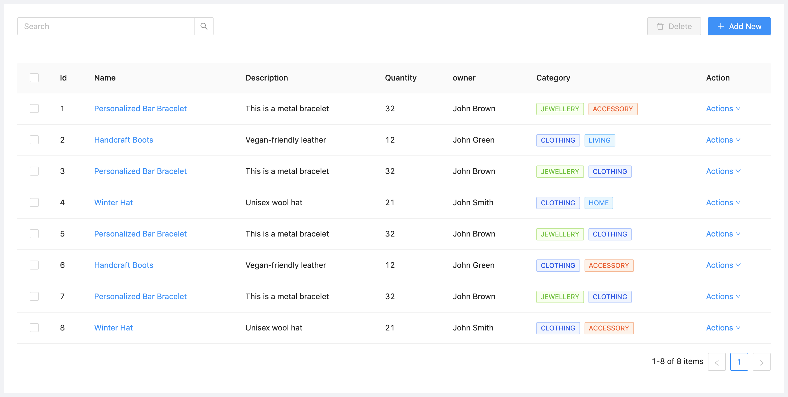
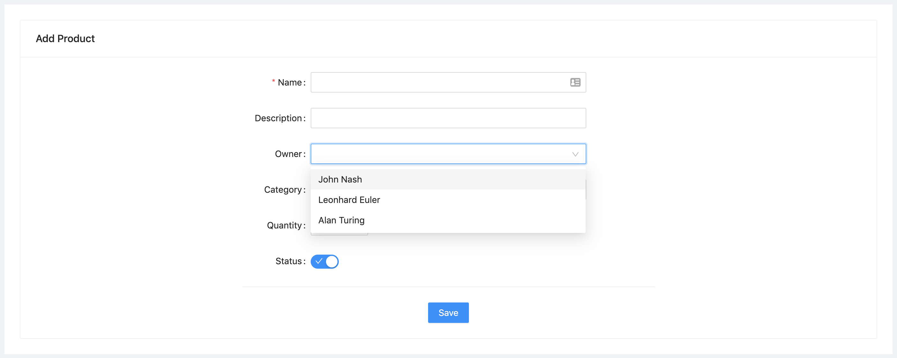

## React Admin Portal

Read the blog posts showinig the step by step implementation:

* [Developing a Modern Admin Portal with React, Redux, and Ant Design (Part-1)](https://turkogluc.com/developing-react-admin-portal-with-redux-and-ant-design/)

* [Developing a Modern Admin Portal with React, Redux, and Ant Design (Part-2)](https://turkogluc.com/developing-admin-portal-with-react-redux-and-ant-design-part-2/)

* [Developing a Modern Admin Portal with React, Redux, and Ant Design (Part-3)](https://turkogluc.com/developing-admin-portal-with-react-redux-and-ant-design-part-3/)

The following repository is used as the base react installation boilerplate:

https://github.com/HashemKhalifa/webpack-react-boilerplate

The final views looks like as follows:

**Dashboard**

**Main Layout Plan**

**Tables**

**Forms**

